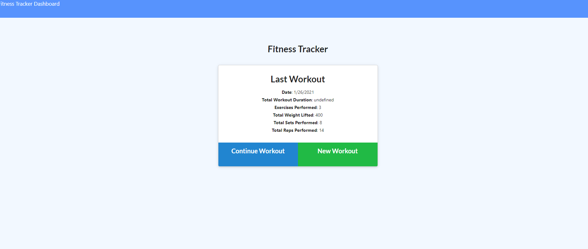
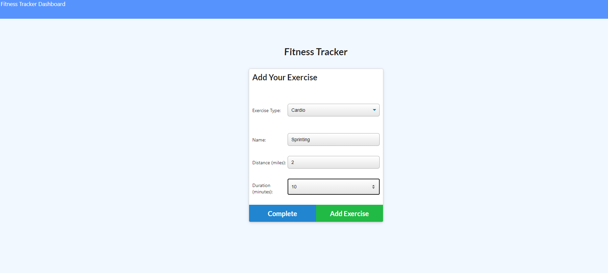
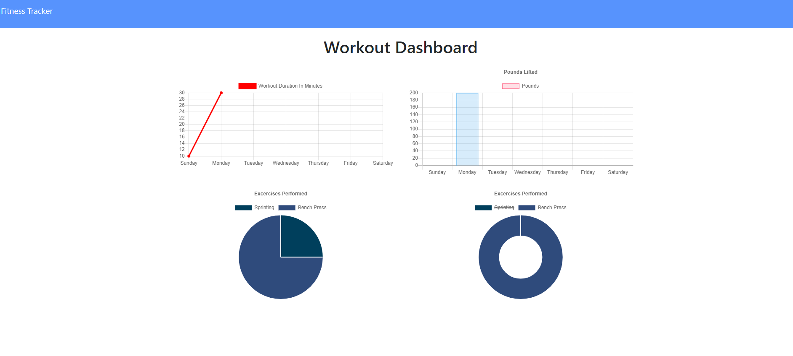

# 13-WorkoutTracker

## Table of Contents

- [Description](#Description)
- [Installation](#Installation)
- [Usage](#Usage)
- [License](#License)
- [Contribution](#Contribution)
- [Tests](#Tests)
- [Questions](#Questions)

## Description

It is a web application that allows you to track your workouts.

## Screenshots

-home screen

-adding a new workout

-stats

## Installation

you don't need to install anything you can use the site as is.

## Usage

you would go to the website and then type in the work out that you just completed and then click add and then you can check your last workout on the home screen and see all your workouts on the stats/dashboard screen.

## License

## Contributing

You don't need to contrubute but if you want to you can email me.

## Tests

none

## Questions

- GitHub Username: [LoganPippin](github.com/LoganPippin)
- Email: logan.pippin32@gmail.com
